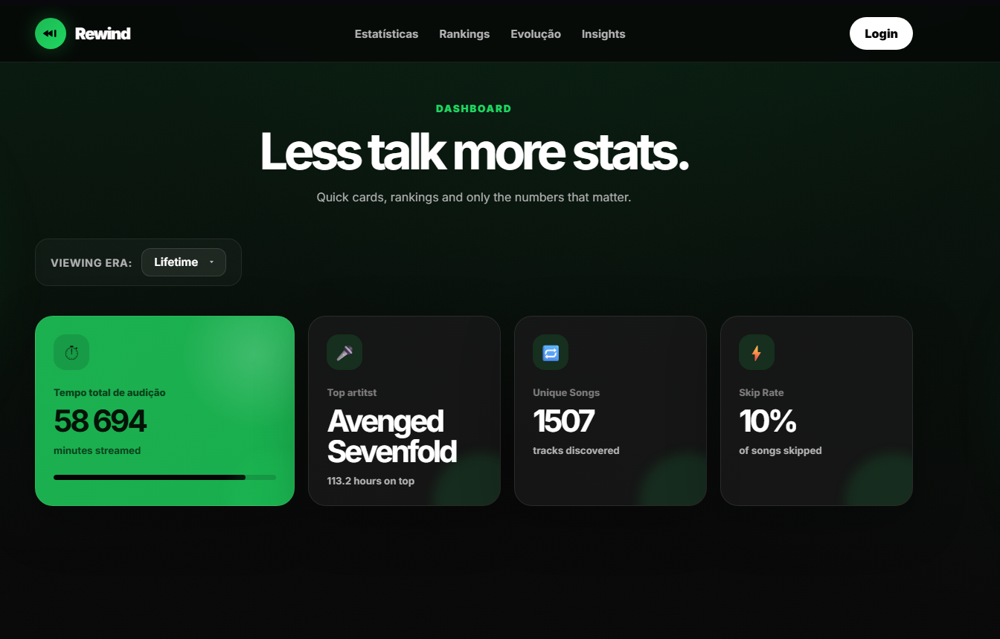

# 🎵📊 Personal Spotify Rewinder (Wrapped)

An interactive web dashboard built with **Flask** and **Pandas** to visualize and analyze the complete streaming history of a Spotify user using the JSON data files extracted from their account.

---

## 📸 Preview Demo



---

## ✨ Main Features

### 🚀 Web Architecture & Performance
* **Dynamic Filters:** Filter between the available years in your data (specific year vs. Lifetime Listening). The graphs and insights update instantly in the background via **AJAX (Fetch API)** without needing to refresh the page.
* **Data Caching:** Data processed by Pandas is temporarily stored in the server's memory using a unique session ID (`uuid`), eliminating the need to re-upload files if the user changes tabs or refreshes the page.
* **Fluid & Responsive Interface:** Flexible grid built with pure CSS that adapts seamlessly to any screen size, from wide desktops to mobile devices.
* **Loading Overlay:** A premium animated spinner with a *glassmorphism* blur effect that provides visual feedback while the server handles data aggregations or external API requests.

### 📈 Insights & Statistics

* **General View:**
  * **Primary KPIs:** Total streaming time (minutes), Number 1 Artist, and Unique Song counter.
  * Line chart tracking the monthly evolution of your streaming time.
  * **Listener Profile:** An algorithmic behavioral classification based on your skipping habits (*The Devoted Listener*, *The Balanced Curator*, or *The Impatient DJ*).
  * **Binge Record Day:** Automatically identifies the exact calendar day with the highest streaming spike, showing total hours spent and the featured artist.
  * **Late Night Tracks:** Total counter for songs played during the early morning hours (00:00 AM - 06:00 AM).

* **Daily Habits:**
  * **Weekly Bubble Punchcard:** A scatter plot crossing days of the week with the 24 hours of the day to pinpoint your exact listening routines and intensity peaks.
  * **Clean Donut Chart:** Displays song ending reasons with an intelligent auto-grouping mechanism (*Completed*, *Skipped*, *Others*) to avoid visual clutter from rare system codes.

* **Music Eras:**
  * Horizontal bar chart highlighting your Top 10 Artists.
  * Detailed ranking table showcasing exact play counts.
  * **Dynamic Spotlight:** An asynchronous background request to the **Official Spotify Web API** that fetches and merges the real-time profile picture of your number one artist as a translucid card background.

---

## 🛠️ Tech Stack

* **Backend:** Python 3.x, Flask (REST JSON API, Sessions, and Routing)
* **Data Crunching:** Pandas (Time-series manipulation and complex aggregations)
* **Data Visualization:** Plotly Express / Plotly Graph Objects (Interactive native HTML charts)
* **Frontend:** HTML5, Advanced CSS3 (Variables, Grid, Flexbox, Filter Effects) & Modern JavaScript (Fetch API / Async DOM manipulation)
* **External API:** Spotify Web API (Client Credentials Flow via Python's `requests` library)

---

## 🚀 How to Run the Project Locally

### 1. Prerequisites
Make sure you have Python 3 installed on your machine.

### 2. Clone the Repository

### 3. Setup a .venv Environment (Recommended)
```bash
#Windows:
python -m venv .venv
venv\Scripts\activate

#Mac/Linux:
python3 -m venv .venv
source venv/bin/activate
```

### 4. Install Dependencies
```bash
pip install -r requirements.txt
```

### 5. Configure Spotify API Keys (For Artist Spotlight Image)
* Go to  and create a free app
* Open the section/eras.py file
* Replace the placeholder strings with your credentials
```python
SPOTIFY_CLIENT_ID = "YOUR_ACTUAL_CLIENT_ID_HERE"
SPOTIFY_CLIENT_SECRET = "YOUR_ACTUAL_CLIENT_SECRET_HERE"
```

### 6. Run the app
```bash
python app.py
```

## Project Structure
```
spotify-rewind-dashboard/
│
├── app.py                  # Main Flask server and API endpoints
├── data_processing.py      # Core Pandas pipeline for data cleaning and formatting
├── requirements.txt        # Python dependencies list
├── .gitignore              # Git ignore configuration
│
├── sections/               # Isolated Python modules containing business logic
│   ├── general_view.py     # General KPIs and timeline evolution
│   ├── habits.py           # Punchcard scatter plot and Donut charts
│   ├── eras.py             # Top 10 artists and Spotify API integrations
│   └── insights.py         # Analytics (records, profiles, night tracks)
│
├── static/
│   └── style.css           # Complete CSS UI architecture and visual effects
│
└── templates/
    └── index.html          # Structural layout and JavaScript/AJAX core engine
```

## 📄License
This project is licensed under the MIT License - feel free to clone, modify and share it!

Developed by Gonçalo Libânio
